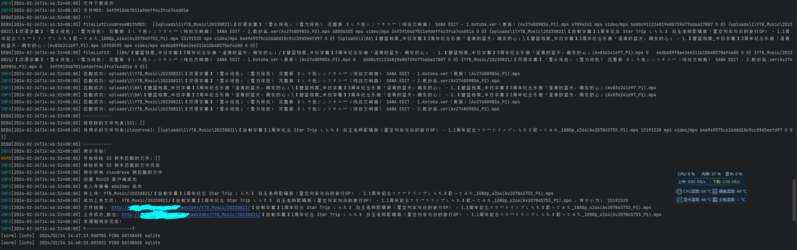
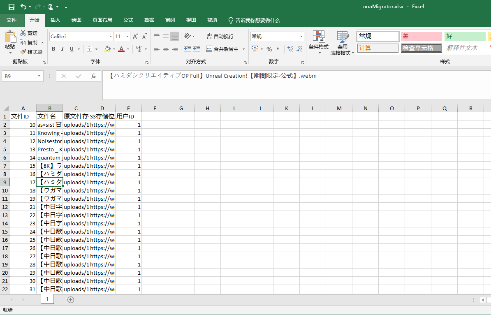

<h1 align="center">noaMigrator</h1>
<h4 align="center">诺亚酱系列小工具——cloudreve本地存储迁移S3存储（OSS、MinIO...） | UshioNoa Cloudreve(Local Storage) to S3 migrate tool</h4>

# 使用场景

Cloudreve 使用本地存储策略，想要迁移到 S3 存储（MinIO...），配合 [CocoaSyncer](https://github.com/luckykeeper/CocoaSyncer) 做多节点分流，防止单点故障，noaMigrator 在提供迁移工具的同时，能够输出一份 cloudreve 的 ID-> 新链接对应表，方便替换迁移，同时也可以做定时同步，在享受 cloudreve 的方便管理能力的同时，兼顾 S3 的方便之处

# 食用方法

参考 config.yaml 的注释，填写配置文件并放置在二进制文件同目录下，推荐放在 cloudreve 运行同目录，cloudreve 需要是本地存储，sqlite 数据库已经测试过，其余数据库没有测试，理论上应该支持，打包了其它数据库的驱动，可以尝试

**特别提示：请务必注意数据库和数据文件的备份，程序作者不对任何数据丢失和损坏负责**

生成的 Excel ，如果需要做迁移，比对生成外链的里面的 id ，然后换成 Excel 文件里面的 S3 存储位置即可

在 api 端口的 /v1/checkpoint/ready 和 /v1/checkpoint/liveness ，提供的存活检测端口，检测该端口可判断程序是否正常运行

# 运行截图

   
运行截图(点击箭头展开/收合图片)
   

   
生成Excel(点击箭头展开/收合图片)
   

# 优香酱系列小工具导航

- GitHub - luckykeeper/RESTCONF-YuukaChan: 优香酱华为 USG 系列设备北向管理小工具 | HayaseYuuka Huawei USG Series Device RESTCONF Management Tool
  https://github.com/luckykeeper/RESTCONF-YuukaChan
- GitHub - luckykeeper/YuukaChan-DPTECH: 优香酱迪普 FW 系列设备管理小工具 | HayaseYuuka DPTech FW Series Device Management Tool
  https://github.com/luckykeeper/YuukaChan-DPTECH
- GitHub - luckykeeper/YuukaDownloader: 优香酱系列小工具——快速解析初音站(yngal/fufugal)链接并送Aria2下载
  https://github.com/luckykeeper/YuukaDownloader
- GitHub - luckykeeper/YuukaChan-Ruijie-WS6xxx-Exporter: 优香酱系列小工具——锐捷AC WS6xxx 系列 Prometheus Exporter ，附带 Grafana 仪表盘模板 | HayaseYuuka Ruijie AC WS6xxx Series Prometheus Exporter With Grafana Template Included https://github.com/luckykeeper/YuukaChan-Ruijie-WS6xxx-Exporter
